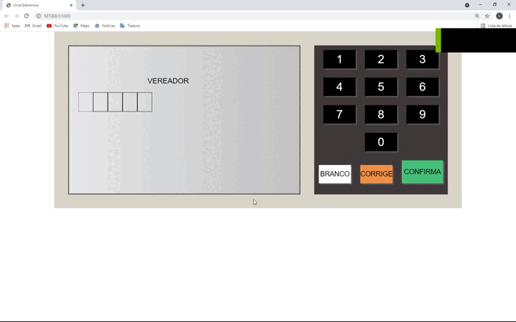

# Urna Eletrônica

## Projeto de uma urna eletrônica desenvolvido em JavaScript, para afins de melhor experiência e adquirir mais conhecimentos, melhores práticas, na linguagem utilizada.

### 🛠 Tecnologias

As seguintes ferramentas foram usadas na construção do projeto:

- [HTML]
- [CSS]
- [JAVASCRIPT]

